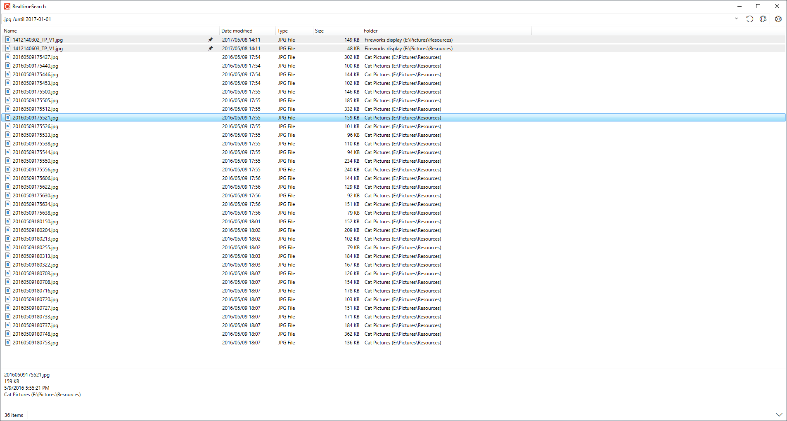

<!-- section: overview -->

## Description

File search tool. Use clipboard text as search key.

  * Clipboard monitoring is available.
  * Indexes search folders and performs incremental search.
  * The fuzzy search makes it easy to search.

### System Requirements

* Windows 10 64bit or higher

## Quick Start

  First, add folders to be searched in the settings. 
  Enter search terms in the text box at the top of the main window to start the search.
  Various operations can be performed from the context menu of the search result files.

<!-- end_section: overview -->

## Download

- [GitHub Releases](https://github.com/neelabo/RealtimeSearch/releases)
- [Microsoft Store](https://www.microsoft.com/store/apps/9NC7FZK2QKZ7)
- [Vector](https://www.vector.co.jp/soft/winnt/util/se511864.html)

#### Package Types

* [About ZIP Version](package-zip.md)
* [About ZIP-fd Version](package-zip-fd.md)
* [About Installer Version](package-installer.md)
* [About Store App](package-storeapp.md)

#### Changelog

 * [Changelog](changelog.md)

## Documents

 * [Search Options](search-options.html)
 * [Privacy Policy](privacy-policy.md)
 * [Contact](contact.md)
