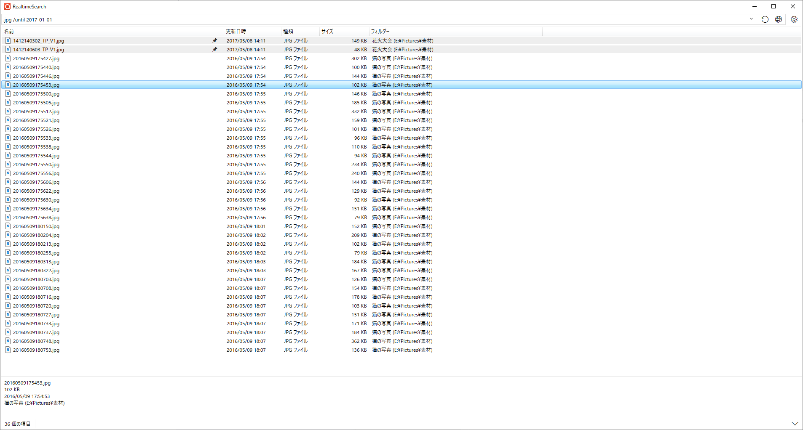

<!-- section: overview -->

##  説明

ファイル検索ツールです。クリップボードのテキストを検索キーとして使用します。

  * クリップボード監視機能があります。
  * 検索フォルダをインデックス化し、インクリメンタルサーチを行います。
  * あいまい検索により検索しやすくなっています。

### システム要件

  * Windows 10 64bit 以降

## クイックスタート

  まず、設定ウィンドウで検索を行うフォルダーを追加します。  
  メインウィンドウ上部のテキストボックスに検索キーワードを入力すれば検索が始まります。  
  検索結果のファイルのコンテキストメニューから各種操作ができます。

<!-- end_section: overview -->

## ダウンロード

- [GitHub Releases](https://github.com/neelabo/RealtimeSearch/releases)
- [Microsoft Store](https://www.microsoft.com/store/apps/9NC7FZK2QKZ7)
- [Vector](https://www.vector.co.jp/soft/winnt/util/se511864.html)

#### パッケージの種類

* [ZIP版について](package-zip.md)
* [ZIP-fd版について](package-zip-fd.md)
* [インストーラー版について](package-installer.md)
* [ストアアプリについて](package-storeapp.md)

#### 更新履歴

* [更新履歴](changelog.md)

## ドキュメント

* [検索オプション](search-options.html)
* [プライバシーポリシー](privacy-policy.md)
* [問い合わせ先](contact.md)
